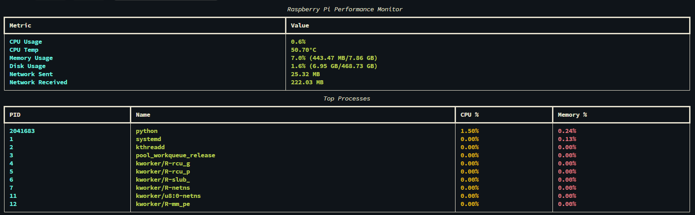

# Pi Full Monitor Documentation

## Overview
Pi Full Monitor is a Python-based CLI tool designed for monitoring the performance and health of a Raspberry Pi device in real-time. It provides insights into CPU usage, memory, disk, network activity, and running processes. The tool is built with a visually appealing dashboard using the `rich` library.



---

## Features
- **Real-time Monitoring**: Automatically refreshes system statistics every 2 seconds.
- **Comprehensive Metrics**:
  - CPU Usage and Temperature
  - Memory Usage
  - Disk Usage
  - Network Activity (Sent and Received Data)
  - Top Processes by CPU and Memory Usage
- **Simple Installation**: Comes with a setup script to install all dependencies.
- **Cross-Platform**: Designed for Raspberry Pi but can work on any Linux-based system.

---

## Installation

### Prerequisites
Ensure the following are installed on your Raspberry Pi:
- Python 3.6 or newer
- `pip` package manager
- `venv` module

### Steps
1. Clone the repository:
   ```bash
   git clone https://github.com/exfil0/pi_full_monitor.git
   ```
2. Navigate to the project directory:
   ```bash
   cd pi_full_monitor
   ```
3. Make the installation script executable:
   ```bash
   chmod +x install.sh
   ```
4. Run the installation script:
   ```bash
   ./install.sh
   ```
   The script will:
   - Create a Python virtual environment.
   - Install all required dependencies.
   - Set up the tool for use.

---

## Usage
1. Run the tool using the following command:
   ```bash
   pi_full_monitor
   ```
   If the command is not found, ensure the virtual environment is activated or the alias is correctly configured:
   ```bash
   source venv/bin/activate
   python3 -m pi_monitor
   ```

2. Press `Ctrl+C` to exit the monitoring dashboard gracefully.

---

## Dashboard Metrics
The dashboard displays the following metrics:

### General System Stats
| Metric         | Description                                                   |
|----------------|---------------------------------------------------------------|
| **CPU Usage**  | Percentage of CPU being utilized.                             |
| **CPU Temp**   | Current temperature of the CPU.                               |
| **Memory Usage** | Percentage and absolute memory usage (used/total).           |
| **Disk Usage** | Percentage and absolute disk usage (used/total).              |
| **Network Sent** | Total bytes sent over the network since boot.                |
| **Network Received** | Total bytes received over the network since boot.         |

### Top Processes
A separate table lists the top processes sorted by CPU and memory usage, providing visibility into resource-intensive applications.

---

## Development

### Project Structure
```plaintext
pi_full_monitor/
├── pi_monitor/                  # Main package directory
│   ├── __init__.py              # Initializes the package
│   ├── __main__.py              # Entry point for the tool
│   ├── monitor.py               # Core monitoring logic
│   ├── utils.py                 # Utility functions (e.g., formatting, process handling)
├── venv/                        # Virtual environment (created during installation)
├── install.sh                   # Installation script
├── README.md                    # Documentation file
├── requirements.txt             # Python dependencies
├── pyproject.toml               # Build configuration for setuptools
├── setup.py                     # Package setup script
```

### Key Files
- **`pi_monitor/monitor.py`**:
  Contains the logic for gathering and displaying system metrics.
- **`pi_monitor/utils.py`**:
  Helper functions for formatting sizes, fetching processes, etc.
- **`install.sh`**:
  Automates the setup process for the virtual environment and dependencies.

---

## Troubleshooting
### Issue: Command `pi_full_monitor` not found
- Ensure the virtual environment is activated:
  ```bash
  source venv/bin/activate
  ```
- Verify the installation:
  ```bash
  pip show pi-full-monitor
  ```

### Issue: Missing Python Dependencies
- Run the following command to manually install dependencies:
  ```bash
  pip install -r requirements.txt
  ```

### Issue: Permission Denied for `install.sh`
- Make the script executable:
  ```bash
  chmod +x install.sh
  ```

---

## License
This project is licensed under the MIT License. See the `LICENSE` file for details.

---

## Contributing
Contributions are welcome! To contribute:
1. Fork the repository.
2. Create a feature branch:
   ```bash
   git checkout -b feature-name
   ```
3. Commit your changes and push:
   ```bash
   git commit -m "Add feature-name"
   git push origin feature-name
   ```
4. Open a pull request.

---

## Contact
For issues or suggestions, feel free to open an issue on the [GitHub repository](https://github.com/exfil0/pi_full_monitor).

